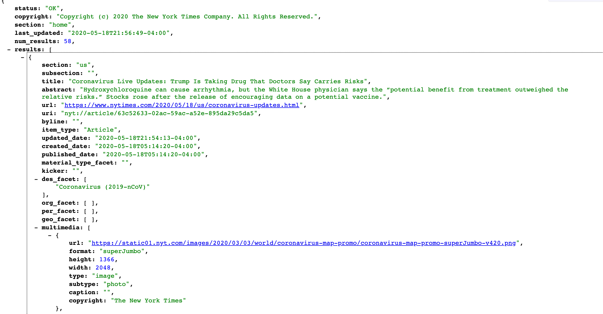

# Building with Spring Boot

***For the following exercise, complete the exercise and please send me the repo link***

## Resources 

- [Consuming a REST Service with Spring Boot](https://spring.io/guides/gs/consuming-rest/)
- [The NYT Top Stories API](https://api.nytimes.com/svc/topstories/v2/home.json?api-key=5Juyps8ID6qTGAC1bcsuk00GB6RfOzer)

Consider the following image of the New York Times Top Stories JSON of the results from the home section:

Based off of what we currently know of JSON objects structure and how to build our own REST Services based off what domains or models we create, please attempt to consume thet NYT Top stories JSON in the home section using the URL given in the Resources section. Please refer to the ***"Consuming a REST Service with Spring"*** lesson for a reminder on how to consume a REST Service with Spring
