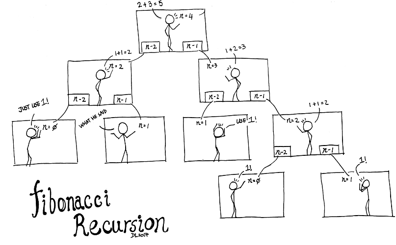

# Recursion

## Goals
* Understand what recursion is
* Understand recursive case & base case
* Understand how to write basic recursive functions

## Lesson

### What is Recursion?

In computer science, recursion basically means a function that calls itself. Recursion can be a little mind bending at first but is actually relatively simple: it's basically just another way to create loops.

In fact, anything that can be done iteratively with a for loop or while loop can also be solved with recursion, and vice versa. There are some languages (like Haskell) that do not even have iterative for loops or while loops at all, and use recursion for all looping instead!

Recursion is often used in functional programming. Mastering recursion can help you do some magical things in code.

Let's dive in.

### So why Recursion?


Imagine there is a big box with smaller boxes in it. These smaller boxes can have more smaller boxes in them. Ultimately, there is ONE key hidden away in one of the boxes. Your job is to search and find that key. 

We can solve this iteratively and recursively. Let's list out the steps for each.

**Iterative Approach:**
1. Pile the boxes to look through.
2. Grab each box one by one, and look through it.
3. If you find a box inside the current box: add it to the end of the pile to look through later.
4. If you find the key, then you’re done!
5. Repeat this cycle.

**Recursive Approach:**
1. Look through the box.
2. If you find a box, go back to Step 1.
3. If you found the key, then you're done!

The recursive approach seems to be the more simpler and straightforward one right? With *less steps* for us to worry about! 

### Writing Recursive Functions

A recursive function is a function that calls itself.

```java
public static void sayHi() {
	System.out.println("Hiya!");
	sayHi();
	}
```

sayHi() is a recursive function. It will priint "hi", then call itself, which will print "hi" and then call itself *AGAIN*, which will print "hi" and call itself...indefinitely. 

<details>
<summary>Recursive Patrick</summary>


</details>

So, how do we get the function to stop?

### The Base Case

The most important part of any recursive function is the 'base case'. The base case is basically a conditional that tells the function to stop calling itself (the base case is usually just a simple `if` statement):

The function should NOT call itself within the base case. In other words, the base case `if` statement should do the very last thing the function does before ending.

Here's another example of a recursive function without a base case:

```java
public static void countDown(int num) {
		 System.out.println(num);
		 countDown(num - 1);
	 }
 }
```

<details>
<summary> When do want this function to stop running? </summary>
        When num is zero
</details>

Let's add that base case:

```java
public static void countDown(int num) {
	 
	 if(num == 0) {
	 System.out.println(num);
	 }
	 else {
		 System.out.println(num);
		 countDown(num - 1);
	 }
 }
```
Make sure your recursive functions always have a base case!

### Handling edge cases.

Even though we added a base case to our countDownToZero function above, it still has the possibility to run forever.

<details>
<summary> For what input to countDownToZero(from:) will run forever?</summary>
If the input is less than zero.
</details>

<details>
<summary>How can we resolve this issue</summary>

```java
static void countDown(int num) {
	 
	 if(num <= 0) {
	 System.out.println(num);
	 }
	 else {
		 System.out.println(num);
		 countDown(num - 1);
	 }
 }
```
</details>

### Recursive vs. Iterative Loops

Given this following loop: 

```java
for(int index = 0; index < array.length; index++) {
		 System.out.println(array[index]);
	 }
```

How would you write this same thing recursively?

<details>
<summary>SOLUTION</summary>

```java
 public static void arrayRecursive(int[] array, int index) {
		         if (index != -1) {
		            arrayRecursive(array,index - 1);
		             System.out.println(array[index]);
		         }
		     }
```
</details>

 Anything that we can solve iteratively, we can solve recurseively and vice versa. 

This leads to a natural question.  If recursion looks more confusing, why would we ever want to use it to solve problems?

### Famous Recursive Problem #1: Factorial

One simple example of how to practically use recursion is with the factorial algorithm.

*Factorial* (symbol: "!") means to multiply a integer by every integer before it.


The pattern is like what's shown below:

```
0! = 1
1! = 1
2! = 2 * 1
3! = 3 * 2 * 1
4! = 4 * 3 * 2 * 1
5! = 5 * 4 * 3 * 2 * 1
```
```
Example: 5! = 5 * 4 * 3 * 2 * 1 = 120
```

Let's make an iterative solution first.

<details>
<summary>Iterative Factorial</summary>

```java
 public static int factorial(int num) 
    { 
        int result = 1;
        int i; 
        
        for (i = 2; i <= num; i++) { 
            result *= i; 
        }
            return result; 
    } 
```
</details>

This actually requires some thought. We need to run a while loop as long as the solution isn't finished. 

Now what if we wanted to do this recursively? Try it yourself!

<details>
<summary>Recursive Factorial</summary>
https://codingbat.com/prob/p154669

</details>

### Famous Recursive Problem #2: Fibonacci

A common, real world example of when to use recursion is the Fibonacci sequence. Here is an iterative solution for finding the nth number of a Fibonacci sequence:

The Fibonacci sequence is made by adding the two previous numbers together:

```
0, 1, 1, 2, 3, 5, 8, 13, 21, 34 ...
```

If we were to take a short Fibonacci sequence: [0, 1, 1, 2, 3, 5, 8, 13, 21] and fib(4), the result would be equal to 3, so basically we need to return an element with index 4 from our Fibonacci sequence array.

Let's made an iterative solution first, then let's compare it to a recursive solution:

<details>
<summary>Iterative Fibonacci</summary>

```java
public class Fibonacci {

    public static void main(String[] args) {

        int n = 10, t1 = 0, t2 = 1;
        System.out.print("First " + n + " terms: ");

        for (int i = 1; i <= n; ++i)
        {
            System.out.print(t1 + " + ");

            int sum = t1 + t2;
            t1 = t2;
            t2 = sum;
        }
    }
}
```
</details>

Pretty cool right? How about if we wanted to solve this recursively? Try the Coding Bat!

<details>
<summary>Recursive Fibonacci</summary>
https://codingbat.com/prob/p120015
</details>



### When to use recursion

In general, you should only use recursion if it would be significantly simpler than the iterative solution. A good rule of thumb is to use recursion when it helps makes your code more readable. In most cases iterative solutions are preferable over recursive solutions because recursion has some added performance costs, like extra function calls.


